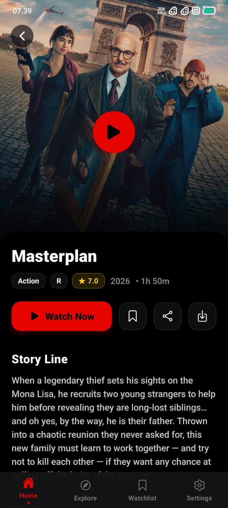

<div align="center">

# 🎬 FLUX Releases

**The unified, high-performance streaming application for Desktop, Mobile & TV.**

Stream your favorite movies, TV shows, anime, and manga with cinema-grade playback, multi-audio & subtitle support, personalized watchlists, and smooth cross-platform performance.

<p align="center">
  <a href="https://github.com/wadecalvin9/flux-releases/releases/latest">
    
  </a>
  <a href="https://github.com/wadecalvin9/flux-releases/releases/download/v1.0.0/FluxMobile-release.apk">
    
  </a>
  <a href="https://github.com/wadecalvin9/flux-releases/releases">
    
  </a>
  
</p>

</div>

---

## 📥 Downloads

Get the official, latest builds of FLUX below. Links always point directly to verified binary assets from the latest releases.

| Platform | Target Device | Version | Direct Download |
| :--- | :--- | :--- | :--- |
| **Windows** | Windows 10 / 11 (x64) | `v1.0.12` | [⬇️ **Download FLUX Desktop Installer (.exe)**](https://github.com/wadecalvin9/flux-releases/releases/download/v1.0.12/Flux-Setup-1.0.12.exe) |
| **Android Mobile** | Android Phones & Tablets (7.0+) | `v1.0.1` | [📱 **Download FLUX Mobile APK (.apk)**](https://github.com/wadecalvin9/flux-releases/releases/download/v1.0.0/FluxMobile-release.apk) |
| **Linux (AppImage)** | All Linux Distributions (x64) | `v1.0.12` | [📦 **Download FLUX AppImage**](https://github.com/wadecalvin9/flux-releases/releases/download/v1.0.12/Flux-1.0.12.AppImage) |
| **Linux (Debian)** | Ubuntu / Debian / Mint (`.deb`) | `v1.0.12` | [🐧 **Download FLUX Debian Package**](https://github.com/wadecalvin9/flux-releases/releases/download/v1.0.12/flux_1.0.12_amd64.deb) |

> 💡 **Looking for past releases, checksums, or release notes?** Check the official [GitHub Releases](https://github.com/wadecalvin9/flux-releases/releases) page.

---

## 📱 Mobile Experience

Engineered specifically for handheld devices with responsive touch interactions, curated hero carousels, instant search, and an advanced landscape video player with gesture and Picture-in-Picture controls.

<div align="center">
  <table>
    <thead>
      <tr>
        <th align="center" width="50%">🔥 Home & Discovery</th>
        <th align="center" width="50%">📖 Details & Watchlist</th>
      </tr>
    </thead>
    <tbody>
      <tr>
        <td align="center">
          
          <br />
          <em>Curated featured billboard, trending carousel, and quick category access</em>
        </td>
        <td align="center">
          
          <br />
          <em>In-depth synopsis, ratings, runtime, direct streaming, and bookmarking</em>
        </td>
      </tr>
    </tbody>
  </table>

  <br />

  ### 🎬 Landscape Video Player
  <p>Immersive cinema-grade playback with custom subtitles, multi-audio selection, sleep timer, aspect ratio stretch, and Picture-in-Picture (PiP).</p>
  
</div>

---

## 🖥️ Desktop Experience

Designed for large screens with hardware-accelerated rendering, keyboard shortcuts, Watch Party, and multi-category media organization.

<div align="center">
  <h3>Featured Showcase & Continue Watching</h3>
  
  <br /><br />

  <h3>Series Hub & Episode Browser</h3>
  
  <br /><br />

  <h3>Cinema Video Player</h3>
  
  <br /><br />

  <h3>Profile Customization & Settings</h3>
  
</div>

---

## ✨ Key Features

- **Multi-Device Support**: Full native support for Windows Desktop, Android Smartphones, Android TV, and Linux.
- **Ultra-Crisp Playback**: Support for 4K HDR, adaptive streaming, and hardware-accelerated video decoding.
- **Picture-in-Picture (PiP)**: Multitask while watching your favorite titles without missing a frame.
- **Comprehensive Library**: Stream movies, TV shows, anime, and read manga in one unified app.
- **Subtitles & Multi-Track Audio**: Switch between audio tracks and fetch subtitles with customizable styling.
- **Personalized Avatars & Profiles**: Customize your persona with custom avatars and tailored streaming preferences.

---

## 🚀 Installation Instructions

### 🪟 Windows
1. Download [Flux-Setup-1.0.12.exe](https://github.com/wadecalvin9/flux-releases/releases/download/v1.0.12/Flux-Setup-1.0.12.exe).
2. Double-click the installer and follow the prompt instructions to complete setup.
3. Launch FLUX from your desktop shortcut or Start Menu.

### 📱 Android Mobile & TV
1. Download [FluxMobile-release.apk](https://github.com/wadecalvin9/flux-releases/releases/download/v1.0.0/FluxMobile-release.apk) (for phones/tablets)
2. When prompted, allow installation from **Unknown Sources** in your device security settings.
3. Tap **Install** and launch FLUX.

### 🐧 Linux
- **AppImage**:
  ```bash
  chmod +x Flux-1.0.12.AppImage
  ./Flux-1.0.12.AppImage
  ```
- **Debian / Ubuntu**:
  ```bash
  sudo dpkg -i flux_1.0.12_amd64.deb
  ```

---

<div align="center">
  <sub>Check out the <a href="https://github.com/wadecalvin9/flux-releases/releases">Releases Page</a>.</sub>
</div>
